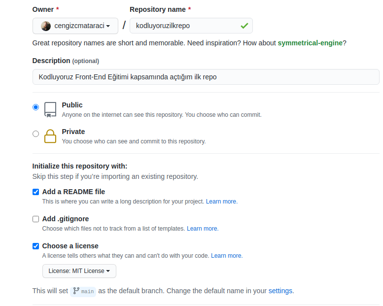

# Kodluyoruz İlk Repo



Bu repo [kodluyoruz](https://kodluyoruz.org) Front-End Eğitiminde oluşturduğum ilk repo. İçerisinde bir adet README dosyası, bir adet de index.html barındırıyor.

## Installation

Öncelikle projeyi clonelayın. 

```
git clone https://github.com/rabiaozcan/kodluyoruzilkrepo.git
```

## Usage

Projeyi cloneladıktandan sonra Visual Studio Code programında açıyoruz.

Linux/Windows için:
```
cd kodluyoruzilkrepo
code .
```

## Contributing

Pull requestler kabul edilir. Büyük değişiklikler için, lütfen önce nereyi değiştirmek istediğinizi tartışmak için bir konu açınız.

## Licence

[MIT](https://choosealicense.com)
